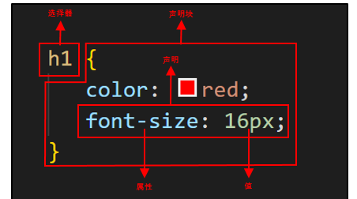

## 简介

CSS (层叠样式表)

CSS 基本语法：



## 选择器

### 元素、类、ID 选择器

元素选择器：选择器为某个 HTML 元素，如 div、h1、p 等

```
h1 {color: blue;}
```

类选择器：前面有一个 . 号，引用元素的 class 属性值

```
.menu {font-weight: bold;}
```

ID 选择器：前面有一个 # 号，引用元素的 id 属性值

```
#toc {color: red;}
```

### 属性选择器

简单属性选择器：选择有某个属性的 HTML 元素

```
h1[class] {background: yellow;}
```

根据具体属性值选择器：选择有特定属性值的 HTML 元素

```
a[href="http://www.baidu.com"] {font-weight: bold;}
```

根据部分属性值选择器：如果属性能接受多个词，可以根据其中的任意一个词进行选择

```
div[class~="warning"] {color: red;} /* 选择 class 属性值中包含 warning 的 div 元素 */
```

子串匹配属性选择器：使用规则对属性值进行匹配

```
div[class^="bar"] {background: gray;} /* 选择 class 属性值以 "bar" 开头的 div 元素 */

div[class$="bar"] {background: gray;} /* 选择 class 属性值以 "bar" 结尾的 div 元素 */

div[class*="bar"] {background: gray;} /* 选择 class 属性值包含 "bar" 的 div 元素 */
```

特定属性选择器：使用特定规则对属性值进行匹配

```
div[lang|="en"] {font-size: 2em;} /* 选择 lang 属性值等于 "en" 或以 "en-" 开头的 div 元素 */
```

### 后代、子代、相邻兄弟、通用兄弟选择器

后代选择器：使用 **空格** 组合两个选择器，如果第二个选择器匹配的元素有与第一个选择器匹配的祖先元素，则它们会被选择

```
div span {margin: 2em;}
```

子代选择器：使用 **>** 组合两个选择器，第二个元素为第一个元素的直接后代 (子元素)

```
div > span {line-height: 20px;}
```

相邻兄弟选择器：使用 **+** 组合两个选择器，第二个元素紧跟在第一个元素之后，且它们有相同的父元素

```
h1 + div {text-align: center;}
```

通用兄弟选择器：使用 **~** 组合两个选择器，第二个元素在第一个元素之后，但无须紧邻，且它们有相同的父元素

```
p ~ span {font-weight: normal;}
```

### 伪类、伪元素

伪类与伪元素是加在选择器后的关键字

常见静态伪类：`:link :visited :first-child :nth-child`

常见动态伪类：`:focus :hover :active`

| 常见伪类         | 作用                                                             |
| :--------------- | :--------------------------------------------------------------- |
| :link            | 选中尚未访问的超链接                                             |
| :visited         | 选中已访问过的超链接                                             |
| :first-child     | 选择元素父元素的第一个子元素 (兄弟元素中的第一个元素)            |
| :nth-child(an+b) | 选择元素兄弟元素中表达式 an+b 匹配到的所有元素 (n = 0, 1, 2 ...) |
| :focus           | 选中可以获得输入焦点的元素                                       |
| :hover           | 指示鼠标悬浮在哪个元素                                           |
| :active          | 指示被用户输入激活的元素                                         |

可以在同一选择器结合使用多个伪类，建议使用 **LVHA** 的先后顺序以正确渲染元素样式，即 `:link :visited :hover :active`，`:focus` 常在 `:hover` 左右

常见伪元素：`::after ::before ::first-letter ::first-line`，`::after ::before` 通常使用 content 属性为元素添加修饰内容

| 常见伪元素     | 作用                                         |
| :------------- | :------------------------------------------- |
| ::after        | 创建一个伪元素，作为选中元素的最后一个子元素 |
| ::before       | 创建一个伪元素，作为选中元素的第一个子元素   |
| ::first-letter | 选中块级元素的首字母                         |
| ::first-line   | 选中块级元素的第一个文本行                   |

```
a::after {content: "|";}

p::first-line {font-size: 150%;}
```

## 继承与层叠

当同一个元素有多个规则时，就需要考虑哪些声明会被应用到该元素，这就涉及到 CSS 的三种机制：特殊性/优先级、继承与层叠

### 特殊性

使用 **!important** 表示重要声明，当重要声明与非重要声明冲突，胜出的总是重要声明

非重要声明需要计算选择器的特殊性值，特殊性值可以表述为 4 个部分，即 x，x，x，x (值从左向右排序，前一个值更大则优先级更高)：

- 每个内联样式声明的特殊性是 1，0，0，0

- 每个 ID 属性选择器的特殊性是 0，1，0，0

- 每个类、属性选择器与伪类的特殊性是 0，0，1，0

- 每个元素选择器与伪元素的特殊性是 0，0，0，1

- 结合符与通配选择器的特殊性是 0，0，0，0 (0 特殊性)

特殊性值计算示例：

```
html > #toc ul > li {color: green;} /* 0, 1, 0, 3 */

*[id="toc"] {color: red;}   /* 0, 0, 1, 0 */
```

### 继承

继承即样式不仅会应用到该元素，还会应用到它的后代元素 (声明会沿着文档树乡下传播给后代元素，但不会向上传播)

一般地，大多数盒模型属性 (内边距、边框、外边距、背景) 都不能继承

继承的值没有特殊性，甚至连 0 特殊性都没有，0 特殊性比无特殊性优先级要高

### 层叠

如果多个规则相冲突，就让样式层叠在一起，层叠规则如下：

- 首先按显示权重对声明排序，重要声明权重高于非重要声明

- 当权重相同，则按特殊性排序

- 当特殊性也相同，则按出现顺序排序，一个声明越后出现，它的优先级越高

## 盒模型

## 参考

CSS 权威指南 (第三版)

[CSS (层叠样式表) \| MDN](https://developer.mozilla.org/zh-CN/docs/Web/CSS)
